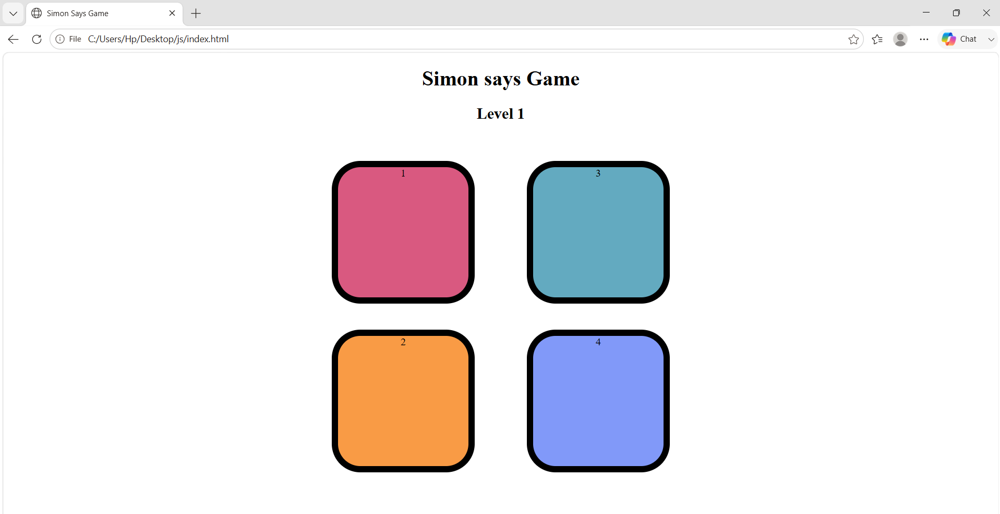

# 🎮 Simon Says Game

> A fun and interactive memory game built with **HTML, CSS, and JavaScript**.

Test your memory and concentration! Watch the sequence of colors, remember it, and repeat it correctly. Each level adds a new color to the sequence, making the game progressively more challenging. 🧠✨

---

## 🌐 Live Demo

🚀 **Play the Game:** [Simon Says Game](https://github.com/shivani-rajput03/Simon-Says-Game)

---

## 📸 Preview



---

## ✨ Features

* 🎯 Interactive memory-based gameplay
* 🎨 Four colorful game buttons
* 📈 Progressive level system
* ✨ Visual button flash effects
* 🧠 Increasing difficulty with every level
* ❌ Game-over detection
* 🔄 Restart functionality
* ⚡ Fast and responsive interaction
* 🎮 Simple and beginner-friendly UI

---

## 🛠️ Technologies Used

| Technology       | Purpose                                     |
| ---------------- | ------------------------------------------- |
| 🧱 **HTML5**     | Creates the game structure                  |
| 🎨 **CSS3**      | Styling, layout, and visual effects         |
| ⚡ **JavaScript** | Game logic, events, and sequence generation |

---

## 🎮 How to Play

1. Press **any key** to start the game.
2. Watch the button that flashes.
3. Click the button that was shown.
4. In the next level, remember the previous sequence.
5. Repeat the complete sequence in the correct order.
6. Continue through as many levels as you can.
7. One wrong move and... **Game Over!** 😈

### 🏆 Challenge

> How high can you score?

---

## 📂 Project Structure

```text
Simon-Says-Game/
│
├── index.html       # Game structure
├── style.css        # Styling and design
├── app.js           # Game logic
├── screenshot.png   # Project preview
└── README.md        # Project documentation
```

---

## 🚀 Getting Started

### 1️⃣ Clone the repository

```bash
git clone https://github.com/shivani-rajput03/Simon-Says-Game.git
```

### 2️⃣ Navigate to the project

```bash
cd Simon-Says-Game
```

### 3️⃣ Run the game

Simply open:

```text
index.html
```

in your web browser.

💡 You can also use **VS Code Live Server** for a better development experience.

---

## 🧠 Concepts Practiced

This project helped me practice and understand:

* DOM Manipulation
* JavaScript Event Listeners
* Arrays
* Functions
* Conditional Statements
* Random Number Generation
* `setTimeout()`
* CSS Classes
* User Interaction
* Game State Management
* Basic Game Logic

---

## 🎯 Future Improvements

Some features that can be added in the future:

* 🔊 Sound effects for each button
* 🏆 High-score tracking
* 📱 Improved mobile responsiveness
* ⏸️ Pause and resume functionality
* 🌙 Dark mode
* 🥇 Leaderboard system
* 🎚️ Difficulty levels

---

## 👩‍💻 Author

### Shivani Rajput

* GitHub: [shivani-rajput03](https://github.com/shivani-rajput03)
* LinkedIn: [Shivani Rajput](https://www.linkedin.com/in/shivani-rajput-042046342)

---

## ⭐ Support

If you enjoyed this project, consider giving the repository a **⭐ Star** on GitHub!

Thanks for checking out my project! 💙

---

### 💻 Built with ❤️ using HTML, CSS & JavaScript
